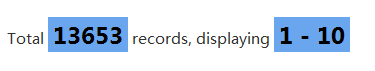
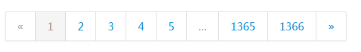
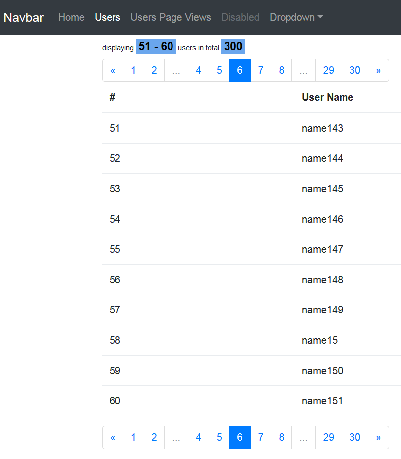

flask-paginate |release| documentation
===========================================

.. module:: flask_paginate

Overview
---------
Latest version: **0.5.1**

**flask-paginate** is a simple paginate extension for
`flask`_ which is reference to `will_paginate`_,
and use `bootstrap`_ as css framework.

**0.2 update**: `foundation`_ is now supported (use **css_framework** parameter)::

    pagination = Pagination(..., css_framework='foundation', **kwargs)

**Note**: Python 2.6+ is required (**string.format** is used to format text)

.. sourcecode:: html+jinja

    {{ pagination.info }}

or

.. figure:: _static/paginate-info2.png
    :alt: The screenshot of paginate information when search

.. sourcecode:: html+jinja

    {{ pagination.links }}

.. highlight:: bash

Installation
------------------------

Install the extension with one of the following commands::

  $ easy_install -U flask-paginate

or alternatively if you have pip installed::

  $ pip install -U flask-paginate

Configuration
------------------

If you want to show the pagination information, add below lines to your
css file.

.. sourcecode:: css

    .pagination-page-info {
        padding: .6em;
        padding-left: 0;
        width: 40em;
        margin: .5em;
        margin-left: 0;
        font-size: 12px;
    }
    .pagination-page-info b {
        color: black;
        background: #6aa6ed;
        padding-left: 2px;
        padding: .1em .25em;
        font-size: 150%;
    }

Test
----
Test file was added since *0.4.6* (thanks to `Rdbaker <https://github.com/Rdbaker>`_)::

  $ pip install -r test-requirements.txt
  $ cd tests
  $ pytest tests.py

How to use
------------
In your flask views file (e.g. views/users.py)::

    from flask import Blueprint
    from flask_paginate import Pagination, get_page_parameter

    mod = Blueprint('users', __name__)

    @mod.route('/')
    def index():
        search = False
        q = request.args.get('q')
        if q:
            search = True

        page = request.args.get(get_page_parameter(), type=int, default=1)

        users = User.find(...)
        pagination = Pagination(page=page, total=users.count(), search=search, record_name='users')
        # 'page' is the default name of the page parameter, it can be customized
        # e.g. Pagination(page_parameter='p', ...)
        # or set PAGE_PARAMETER in config file
        # also likes page_parameter, you can customize for per_page_parameter
        # you can set PER_PAGE_PARAMETER in config file
        # e.g. Pagination(per_page_parameter='pp')

        return render_template('users/index.html',
                               users=users,
                               pagination=pagination,
                               )

In the **users/index.html**:

.. sourcecode:: html+jinja

    {{ pagination.info }}
    {{ pagination.links }}
    <table>
      <thead>
        <tr>
          <th>#</th>
          <th>Name</th>
          <th>Email</th>
        </tr>
      </thead>
      <tbody>
        
          <tr>
            <td>{{ loop.index + pagination.skip }}</td>
            <td>{{ user.name }}</td>
            <td>{{ user.email }}</td>
          </tr>
        
      </tbody>
    </table>
    {{ pagination.links }}

Example
-------

**Note**: 0.2.9 requires `click <http://click.pocoo.org/>`_ to run example.

.. sourcecode:: sh

    $cd example
    $python sql.py --help
    $python sql.py init_db
    $python sql.py fill_data --total=300
    $cp app.cfg.example app.cfg
    $echo edit app.cfg
    $python app.py --port 5000

Open `<http://localhost:5000>`_ to see the example page.

Deep into the Pagination
--------------------------

Below are the params for **Pagination.__init__()**, you can change the settings here.

    **found**: used when searching

    **page**: current page

    **per_page**: how many records displayed on one page

    **page_parameter**: a name(string) of a GET parameter that holds
    a page index. Use it if you want to iterate over multiple Pagination
    objects simultaniously. defautl is **'page'**.

    **per_page_parameter**: a name for `per_page` likes page_parameter.
    default is **'per_page'**.

    **inner_window**: how many links arround current page

    **outer_window**: how many links near first/last link

    **prev_label**: text for previous page, default is **'&laquo;'**

    **next_label**: text for next page, default is **'&raquo;'**

    **search**: search or not?

    **total**: total records for pagination

    **display_msg**: text for pagation information

    **search_msg**: text for search information

    **record_name**: record name showed in pagination information

    **link_size**: font size of page links

    **alignment**: the alignment of pagination links

    **href**: Add custom href for links - this supports forms \
    with post method. MUST contain {0} to format page number

    **show_single_page**: decide whether or not a single page \
    returns pagination

    **bs_version**: the version of bootstrap, default is **2**

    **css_framework**: the css framework, default is **'bootstrap'**

    **anchor**: anchor parameter, appends to page href

    **format_total**: number format total, like **1,234**, \
    default is False

    **format_number**: number format start and end, like **1,234**, \
    default is False

API
------------------

.. autoclass:: Pagination
   :members:

.. toctree::
   :maxdepth: 2

Contributors
------------

- `DoctorMalboro <https://github.com/DoctorMalboro>`_
- `MasterMind2k <https://github.com/MasterMind2k>`_
- `alcaras <https://github.com/alcaras>`_
- `mozillazg <https://github.com/mozillazg>`_
- `DYFeng <https://github.com/DYFeng>`_
- `ilya-il <https://github.com/ilya-il>`_
- `mkaplenko <https://github.com/mkaplenko>`_
- `trein <https://github.com/trein>`_
- `tark-hidden <https://github.com/tark-hidden>`_
- `wong2 <https://github.com/wong2>`_
- `voltterra <https://github.com/voltterra>`_
- `Rdbaker <https://github.com/Rdbaker>`_

Changelog
---------
Version 0.5.1
-------------

- add `bootstrap4` support

Version 0.5.0
-------------

- Make clear and easy customized for page/per_page parameter per on `issue 50 <https://github.com/lixxu/flask-paginate/issues/50>`_
- add `get_page_parameter` and `get_per_page_parameter` for customization

Version 0.4.6
-------------

(bug fix release, released on May 31th 2017)

- bug fix: - Incorrect right-most window value on outer_window=0 `issue 51 <https://github.com/lixxu/flask-paginate/issues/51>`_
- add tests file

Version 0.4.5
-------------
Added new parameter `page_parameter` to simultaniously interate over multiple Pagination objects.
See documentation

Version 0.4.4
-------------

bug fix: - TypeError: url_for() got multiple values for keyword argument 'page' `issue 47 <https://github.com/lixxu/flask-paginate/issues/47>`_

Version 0.4.3
-------------

use `flask_paginate` insetad of `flask.ext.paginate` for new version of flask

Version 0.4.2
-------------

add get_page_args() function, and change the way to get url args

Version 0.4.1
-------------

remove href for disabled links to prevent navigating to top of page when clicks

Version 0.3.2
-------------

0.3.1 file upload failed, increase the version number.

Version 0.3.1
-------------

(bug fix release, released on Apr 18th 2015)

- URL has no necessary to unquote for links `issue 26 <https://github.com/lixxu/flask-paginate/issues/26>`_

Version 0.3.0
-------------

(small feature release, released on Apr 14th 2015)

- Add option to number format total `issue 29 <https://github.com/lixxu/flask-paginate/issues/29>`_, and also can format start and end

Version 0.2.9
-------------

(bugfix release, released on Apr 13th 2015)

- Last release did not fix the bug `bug 24 <https://github.com/lixxu/flask-paginate/issues/24>`_ actually.
  Thanks `MasterMind2k <https://github.com/MasterMind2k>`_ fix it finally.
- Use `click <http://click.pocoo.org/>`_ for example code

Version 0.2.8
-------------

(bugfix release, released on Nov 2nd 2014)

- Flat args for non-multi values style urls. This is used to fix the bug
  `<https://github.com/lixxu/flask-paginate/issues/24>`_
  when generated url likes this (`http://xxxxxx/something/[u'param']?page=2`)
- Use `<http://flask.pocoo.org/docs/0.10/api/#flask.Markup>`_ when generating
  url so that template no need to use `safe` filter any more.

.. _Flask: http://flask.pocoo.org/
.. _will_paginate: https://github.com/mislav/will_paginate/wiki
.. _bootstrap: http://twitter.github.com/bootstrap/
.. _foundation: http://foundation.zurb.com/
